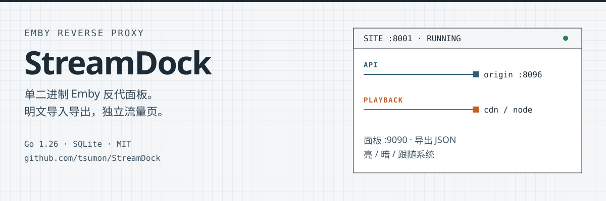
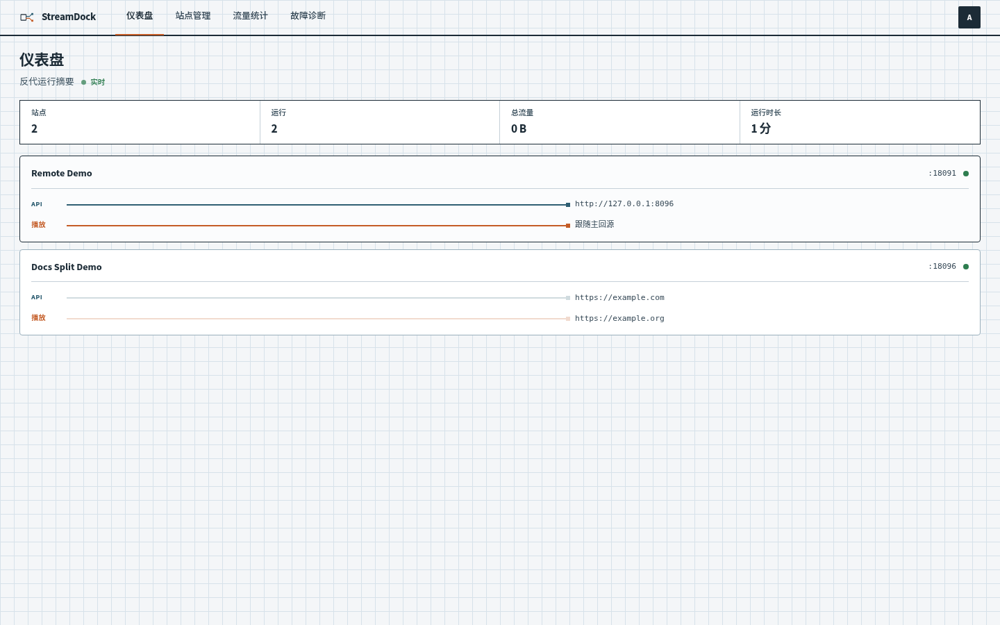
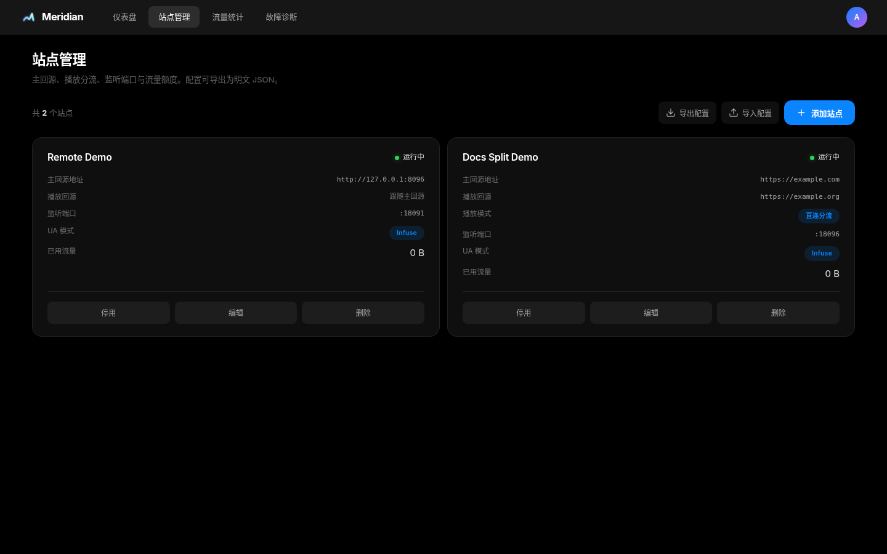
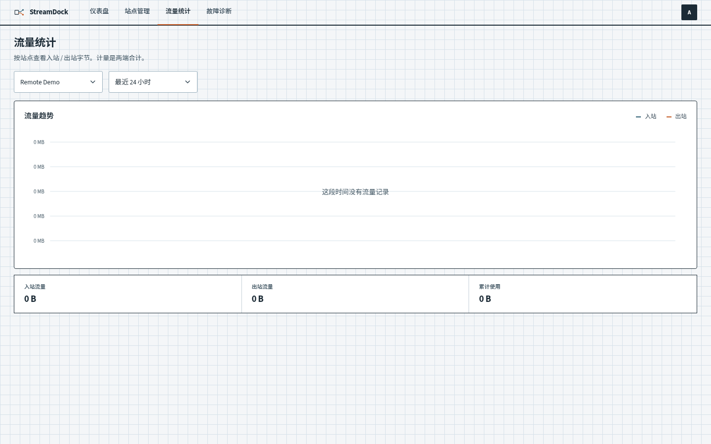
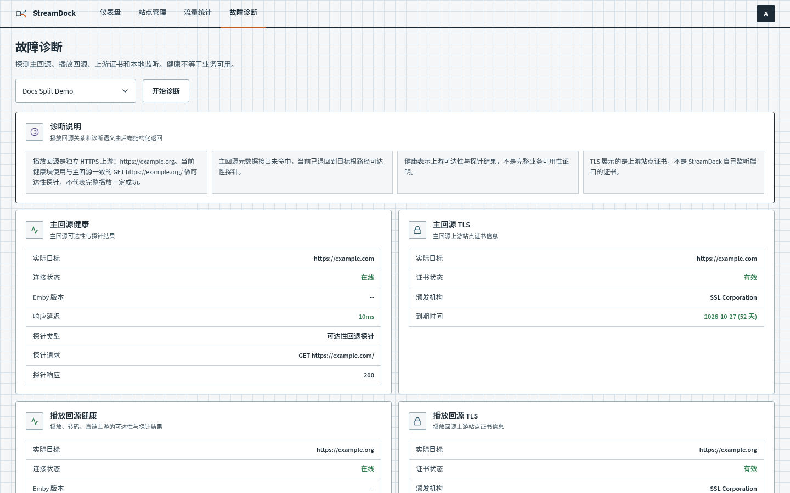
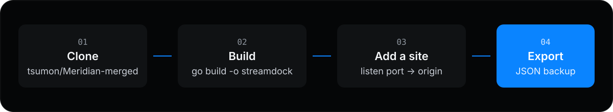

<p align="center">
  
</p>

<p align="center">
  <a href="https://go.dev"></a>
  <a href="https://pkg.go.dev/modernc.org/sqlite"></a>
  <a href="LICENSE"></a>
</p>

**StreamDock** 是一个单二进制 Emby 反向代理管理面板：浏览器里管站点，SQLite 落盘，前端嵌在同一个进程里。

GitHub 仓库是 [`tsumon/StreamDock`](https://github.com/tsumon/StreamDock)。仓库与产品名均为 StreamDock。

---

## 面板长什么样

四张图来自当前面板，不是示意稿。

<table>
  <tr>
    <td width="50%" valign="top">
      <p align="center"><b>仪表盘</b></p>
      
    </td>
    <td width="50%" valign="top">
      <p align="center"><b>站点</b></p>
      
    </td>
  </tr>
  <tr>
    <td width="50%" valign="top">
      <p align="center"><b>流量</b></p>
      
    </td>
    <td width="50%" valign="top">
      <p align="center"><b>诊断</b></p>
      
    </td>
  </tr>
</table>

---

## 和上游差在哪

本仓是 [snnabb/Meridian](https://github.com/snnabb/Meridian) 的 fork。相对 **当前** 上游（v1.12.4），不要把「分离推流」当成独有功能——上游站点模型里已经有 `playback_target_url` / `playback_mode` / `stream_hosts`。

| 能力 | 本仓 | 上游 |
|------|------|------|
| 明文站点 JSON 导出 / 导入 | 有。`GET /api/sites/export`、`POST /api/sites/import`，只新建不覆盖 | 没有这一对接口。上游是加密全量备份 |
| 独立流量页 `#traffic` | 有 | `#traffic` 并进仪表盘 |
| 分离推流（API 走主回源，播放走 playback） | 有，实现更窄 | 同样有这些字段，还有更完整的发现/改写 |
| 单文件 Go + 四页原生前端 | 有意保持 | 已拆到 `cmd/meridian/`，页面更多 |

备份是明文站点配置（含回源 URL），不含用户、流量或 JWT。新导出 `version` 为 `streamdock-v1`；旧文件 `meridian-v1` 仍能导入。

---

## 它怎么跑

<p align="center">
  
</p>

管理面默认听 `127.0.0.1:9090`。每个站点另开一个端口给 Emby 客户端：API / WebSocket 走 `target_url`，命中播放路径时走 `playback_target_url` 和 `stream_hosts`。

---

## 先跑起来

克隆：

```bash
git clone https://github.com/tsumon/StreamDock.git
cd StreamDock
go build -o streamdock .
JWT_SECRET=$(openssl rand -hex 32) SETUP_TOKEN=$(openssl rand -hex 32) ./streamdock
```

打开 `http://127.0.0.1:9090`。空库第一次创建管理员需要启动日志里的 `SETUP_TOKEN`。

### Docker

```bash
docker run -d --name streamdock \
  -p 9090:9090 -p 8001-8010:8001-8010 \
  -v streamdock-data:/app/data \
  -e JWT_SECRET=$(openssl rand -hex 32) \
  ghcr.io/tsumon/streamdock:latest
```

镜像名是 `ghcr.io/tsumon/streamdock`，不跟 GitHub 仓库名走。容器网络里面板默认绑 `0.0.0.0`。

```yaml
services:
  streamdock:
    image: ghcr.io/tsumon/streamdock:latest
    restart: unless-stopped
    ports:
      - "9090:9090"
      - "8001-8010:8001-8010"
    volumes:
      - streamdock-data:/app/data
    environment:
      - JWT_SECRET=your-secret-here

volumes:
  streamdock-data:
```

源码安装脚本仍从本仓拉取：

```bash
bash <(curl -sL https://raw.githubusercontent.com/tsumon/StreamDock/main/install.sh)
```

systemd unit 是 `streamdock.service`，数据目录 `/opt/streamdock`。安装脚本从 GitHub Releases 拉二进制；没有可用 Release 时会提示改用 Docker 或源码构建。

---

## 配置

```bash
./streamdock                          # 默认 127.0.0.1:9090，数据库 streamdock.db
./streamdock --port 8080
./streamdock --db /data/streamdock.db
```

| 变量 | 默认 | 说明 |
|------|------|------|
| `PORT` | `9090` | 管理面板端口 |
| `DB_PATH` | `streamdock.db` | SQLite 路径。未指定且只有旧的 `meridian.db` 时，会打开旧文件一轮 |
| `JWT_SECRET` | 进程内随机 | 至少 32 字节。不设则重启后会话作废 |
| `SETUP_TOKEN` | 空库时生成 | 创建第一个管理员 |
| `PANEL_BIND_ADDR` | `127.0.0.1` | 非回环必须再设 `ALLOW_INSECURE_HTTP=true`，或前面加 HTTPS 反代 |

会话在 HttpOnly Cookie `streamdock_session` 里。脚本仍可用 `Authorization: Bearer`。

---

## 备份

面板「站点管理」→「导出配置」下载 JSON。文件名 `streamdock_backup_YYYY-MM-DD.json`。导入只新建，端口冲突会跳过。

也可以直接备份 SQLite：

```
streamdock.db
streamdock.db-wal
streamdock.db-shm
```

若部署还在用旧文件名，备份 `meridian.db` 及其 WAL/SHM。恢复时停进程，还原文件，用原来的 `JWT_SECRET` 启动。

---

## 边界

- 只有一个管理员，没有角色。
- 管理面自己不提供 HTTPS。
- JSON 备份是明文，里面有回源 URL。
- 流量每 60 秒刷进 SQLite，异常退出可能丢掉最近一分钟。
- 这不是上游 Meridian 的功能全集，也不是「只改了三个文件」的薄 fork。

安全报告发到本仓库的 [Security Advisory](https://github.com/tsumon/StreamDock/security/advisories/new)，不要发到上游。细节见 [SECURITY.md](SECURITY.md)。贡献方式见 [CONTRIBUTING.md](CONTRIBUTING.md)。

---

## 上游

- [Meridian](https://github.com/snnabb/Meridian) — MIT，原版 Emby 反代管理面板

## License

MIT
