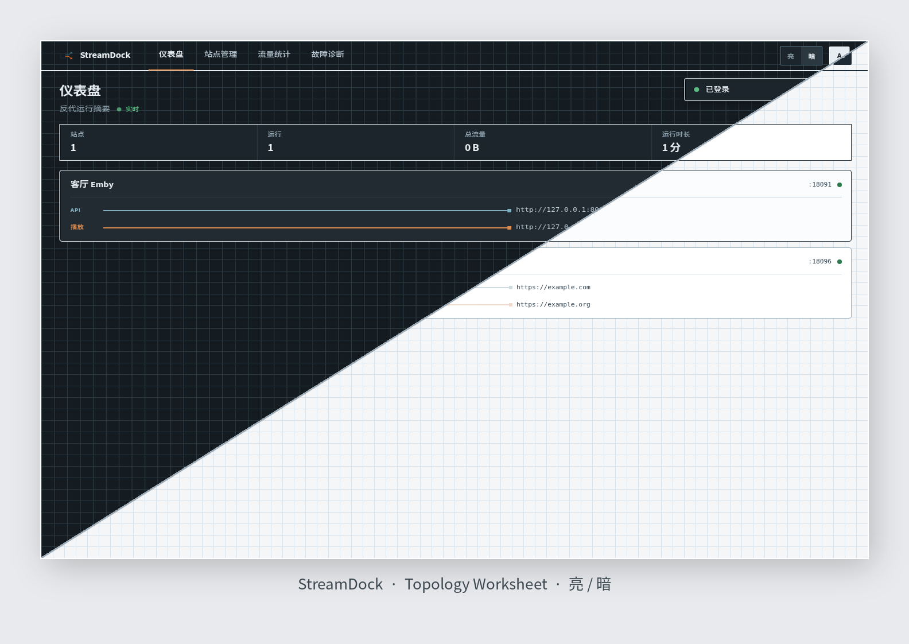
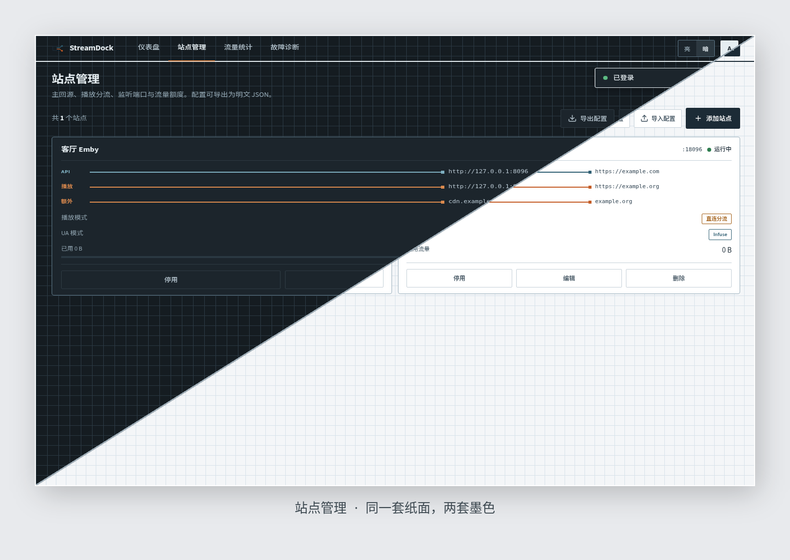

<p align="center">
  
</p>

<p align="center">
  <a href="https://go.dev"></a>
  <a href="https://pkg.go.dev/modernc.org/sqlite"></a>
  <a href="https://github.com/tsumon/StreamDock/releases/latest"></a>
  <a href="LICENSE"></a>
</p>

**Emby 反向代理管理面板**

**StreamDock** 是一个单二进制 Emby 反代面板：浏览器里管站点，SQLite 落盘，前端嵌在同一个进程里。亮 / 暗都是同一套 Topology Worksheet（纸面网格），不是两套皮肤。

仓库：[`tsumon/StreamDock`](https://github.com/tsumon/StreamDock)

---

## 面板长什么样

对角切面：左上暗色 · 右下亮色。同一布局，两套墨色。

<p align="center">
  
</p>

<p align="center">
  
</p>

四页都能用顶栏「亮 / 暗」切换；没有手动偏好时跟随系统。

---

## 它能做什么

- **站点反代**：每个站点一个监听端口；API / WebSocket 走主回源，播放路径可走 playback 分流
- **明文备份**：`导出 / 导入` 站点 JSON（`streamdock-v1`）；只新建、不覆盖；端口冲突跳过
- **独立流量页**：按站点看入站 / 出站，不塞进仪表盘
- **故障诊断**：回源可达、证书、本地监听
- **亮暗主题**：同一套 CSS 变量 remap；偏好写在 `localStorage`

---

## 和上游差在哪

本仓是 [snnabb/Meridian](https://github.com/snnabb/Meridian) 的 fork。相对 **当前** 上游（v1.12.x），不要把「分离推流」当成独有功能——上游站点模型里已经有 `playback_target_url` / `playback_mode` / `stream_hosts`。

| 能力 | 本仓 | 上游 |
|------|------|------|
| 明文站点 JSON 导出 / 导入 | 有。`GET /api/sites/export`、`POST /api/sites/import` | 加密全量备份 |
| 独立流量页 `#traffic` | 有 | 并进仪表盘 |
| Topology Worksheet 亮 / 暗 | 有 | — |
| 分离推流 | 有，实现更窄 | 字段更全，发现 / 改写更完整 |
| 单文件 Go + 原生前端 | 有意保持 | 已拆到 `cmd/meridian/`，页面更多 |

备份是明文站点配置（含回源 URL），不含用户、流量或 JWT。旧文件 `meridian-v1` 仍能导入。

---

## 它怎么跑

<p align="center">
  
</p>

管理面默认听 `127.0.0.1:9090`。每个站点另开端口给 Emby 客户端。

---

## 先跑起来

### 二进制（推荐）

从 [Releases](https://github.com/tsumon/StreamDock/releases/latest) 下载对应平台的 `streamdock-*`：

```bash
chmod +x streamdock-linux-amd64
JWT_SECRET=$(openssl rand -hex 32) SETUP_TOKEN=$(openssl rand -hex 32) ./streamdock-linux-amd64
```

### 源码

```bash
git clone https://github.com/tsumon/StreamDock.git
cd StreamDock
go build -o streamdock .
JWT_SECRET=$(openssl rand -hex 32) SETUP_TOKEN=$(openssl rand -hex 32) ./streamdock
```

打开 `http://127.0.0.1:9090`。空库第一次创建管理员需要启动日志里的 `SETUP_TOKEN`。

### 安装脚本

```bash
bash <(curl -sL https://raw.githubusercontent.com/tsumon/StreamDock/main/install.sh)
```

脚本从 GitHub Releases 拉二进制。systemd unit 是 `streamdock.service`，数据目录 `/opt/streamdock`。

### Docker Compose（推荐）

仓库根目录有 [`docker-compose.yml`](docker-compose.yml)：

```bash
cp .env.example .env
# 编辑 .env，至少填 JWT_SECRET（可用: openssl rand -hex 32）
docker compose up -d
```

面板：`http://127.0.0.1:9090`。站点监听端口默认映射 `8001-8010`，不够就在 compose 里加。

镜像名是 `ghcr.io/tsumon/streamdock`。容器里面板绑 `0.0.0.0`（仅容器网络；前面请加反代或只暴露本机端口）。

### Docker 单容器

```bash
docker run -d --name streamdock \
  -p 9090:9090 -p 8001-8010:8001-8010 \
  -v streamdock-data:/app/data \
  -e JWT_SECRET=$(openssl rand -hex 32) \
  ghcr.io/tsumon/streamdock:latest
```

---

## 配置

```bash
./streamdock                          # 默认 127.0.0.1:9090，数据库 streamdock.db
./streamdock --port 8080
./streamdock --db /data/streamdock.db
./streamdock --version
```

| 变量 | 默认 | 说明 |
|------|------|------|
| `PORT` | `9090` | 管理面板端口 |
| `DB_PATH` | `streamdock.db` | SQLite 路径。未指定且只有旧的 `meridian.db` 时，会打开旧文件一轮 |
| `JWT_SECRET` | 进程内随机 | 至少 32 字节。不设则重启后会话作废 |
| `SETUP_TOKEN` | 空库时生成 | 创建第一个管理员 |
| `PANEL_BIND_ADDR` | `127.0.0.1` | 非回环必须再设 `ALLOW_INSECURE_HTTP=true`，或前面加 HTTPS 反代 |

会话在 HttpOnly Cookie `streamdock_session` 里。脚本仍可用 `Authorization: Bearer`。

---

## 备份

面板「站点管理」→「导出配置」下载 JSON。文件名 `streamdock_backup_YYYY-MM-DD.json`。导入只新建，端口冲突会跳过。

也可以直接备份 SQLite：

```
streamdock.db
streamdock.db-wal
streamdock.db-shm
```

若部署还在用旧文件名，备份 `meridian.db` 及其 WAL/SHM。恢复时停进程，还原文件，用原来的 `JWT_SECRET` 启动。

---

## 边界

- 只有一个管理员，没有角色。
- 管理面自己不提供 HTTPS。
- JSON 备份是明文，里面有回源 URL。
- 流量每 60 秒刷进 SQLite，异常退出可能丢掉最近一分钟。
- 这不是上游 Meridian 的功能全集，也不是「只改了三个文件」的薄 fork。

安全报告发到本仓库的 [Security Advisory](https://github.com/tsumon/StreamDock/security/advisories/new)，不要发到上游。细节见 [SECURITY.md](SECURITY.md)。贡献方式见 [CONTRIBUTING.md](CONTRIBUTING.md)。

---

## 上游

- [Meridian](https://github.com/snnabb/Meridian) — MIT，原版 Emby 反代管理面板

## License

MIT
